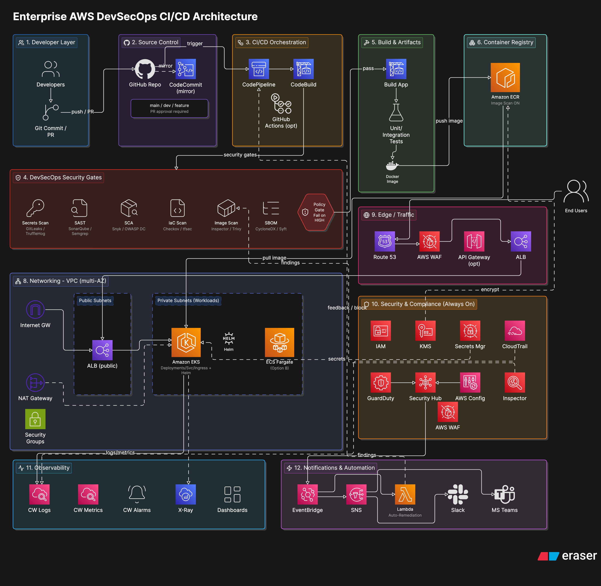

# DevSecOps CI/CD Pipeline

## Architecture

## Features
- CI/CD automation
- Docker containerization
- AWS ECR image registry
- EC2 deployment via SSH
- Flask application with health checks

## How to run locally
docker build -t devsecops .
docker run -p 8080:8080 devsecops

## Endpoints
/ → App
/health → Health check
